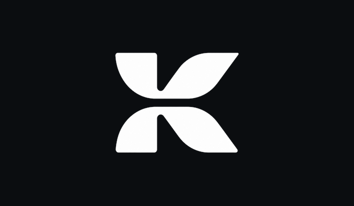

<p align="center">
  
</p>

<h1 align="center">Keen</h1>

<p align="center">
  <strong>Android TV browser for streaming sites and D-pad remotes.</strong><br>
  Not a phone browser. Not a desktop browser. TV-only.
</p>

<p align="center">
  <a href="releases/keen-0.1.14-armeabi-v7a.apk"></a>
  &nbsp;
  <a href="https://github.com/SirPrizeNZ/keen/releases/latest"></a>
</p>

---

## Download

| | |
|:--|:--|
| **Build** | v0.1.14 |
| **Target** | Android TV · **32-bit ARM (`armeabi-v7a`)** |
| **Package** | **[keen-0.1.14-armeabi-v7a.apk](releases/keen-0.1.14-armeabi-v7a.apk)** |
| **Checksums** | [`releases/SHA256SUMS`](releases/SHA256SUMS) |
| **GitHub Release** | [v0.1.14](https://github.com/SirPrizeNZ/keen/releases/tag/v0.1.14) |

```bash
adb connect <tv-ip>:5555
adb install -r releases/keen-0.1.14-armeabi-v7a.apk
```

Requires **Android TV / Google TV · API 29+ (Android 10+)**.

---

## Purpose

Keen exists to make real streaming websites usable on a television with a **standard remote**.

Android TV browsers are usually general-purpose web shells: they open pages, but they are not built around catalogue browsing, nested players, fullscreen video, or hostile interstitials. Streaming sites punish that gap.

Keen is built around one journey:

```text
Launch → open site → find content → play → fullscreen → control with D-pad → back out cleanly
```

---

## How it differs from other Android TV browsers

Compared only to browsers people actually use on Android TV / Google TV / Fire TV–class devices (system WebView shells, TV Bro–class apps, vendor TV browsers, remote-pointer Chromium skins).

<br>

### Focus

| | Typical Android TV browser | Keen |
|:--|:---------------------------|:-----|
| **Job to be done** | Browse the open web on a TV screen | Complete a **streaming journey** with a remote |
| **Form factor** | TV port of a general browser | **Android TV–only product** |
| **Session model** | Tabs, history, multi-page browsing | Single linear path: site → play → exit |

<br>

### Input & chrome

| | Typical Android TV browser | Keen |
|:--|:---------------------------|:-----|
| **Primary input** | D-pad focus traps, occasional on-screen cursor | Continuous remote pointer + DOM focus, long-press mode toggle |
| **URL / chrome** | Full browser chrome (tabs, bookmarks, menus) | Minimal shell: URL bar, progress, pointer |
| **Rails / carousels** | Often broken or edge-scroll only | Horizontal scroll under the pointer (Netflix-style rows) |

<br>

### Streaming & hostility

| | Typical Android TV browser | Keen |
|:--|:---------------------------|:-----|
| **Playback** | Generic page; fullscreen is the site’s problem | Playback-oriented WebView path (fullscreen, media-oriented remote use) |
| **Popups / traps** | User dismisses with awkward focus | Overlay / “not a robot” / QR interstitial guard (SPA-safe) |
| **Engine** | Embedded Chromium *or* thin WebView wrapper | **System WebView** — small install, engine follows the OS |

<br>

### Explicit non-goals

Keen is **not** a general Android TV Chrome substitute, a tabbed multi-window browser, a phone browser with a leanback icon, a Chromium fork, or a download/VPN client.

---

## Platform & ABI

| | |
|:--|:--|
| **Form factor** | Android TV / Google TV only |
| **minSdk** | 29 (Android 10) |
| **targetSdk** | 35 |
| **Primary release** | **`armeabi-v7a` (32-bit ARM)** |
| **arm64-v8a APK** | Not shipped yet |
| **Runtime** | Kotlin / Java + System WebView (no app JNI today) |

**Why 32-bit first:** a large share of living-room Android TV boxes still run **ARMv7**. The published package is the `armeabiV7a` flavour (`com.keenzero.app.v7a`).

A pure-Java `universal` flavour can install on 64-bit devices, but the **supported, signed download is the 32-bit ARMv7 APK**. A dedicated arm64 package will ship when it is a first-class product target.

---

## Features (current)

- Leanback launcher entry and TV banner  
- System WebView browse surface  
- Continuous remote pointer (hold-to-move) and long-press mode toggle  
- URL bar usable from the pointer; Enter loads and dismisses the IME  
- Horizontal rail scroll under the pointer  
- Hostile interstitial / QR “confirm you’re not a robot” guard (SPA-safe)  
- Navigation containment for common trap patterns  
- Host-based blocking assets for lab / baseline lists  

---

## Build from source

Requirements: JDK 17, Android SDK 35. Release builds need a keystore under `~/.keen-zero/signing/`.

```bash
./gradlew :app:assembleArmeabiV7aRelease
# app/build/outputs/apk/armeabiV7a/release/app-armeabiV7a-release.apk
```

```bash
./gradlew :app:assembleArmeabiV7aDebug
```

---

## Repository layout

```text
app/           Android application (Kotlin)
branding/      Icon + TV banner masters and density pack
assets/        README logo (white cutout + hero)
releases/      Published APK + checksums
```

Lab HTML under `app/src/main/assets/lab/` is for development and checks, not end-user content.

---

## Status

Pre-release. Validated on physical Android TV hardware (ARMv7). Hostile sites will still bite; open issues with device model, WebView version, and URL.

---

## License

[MIT](LICENSE)
