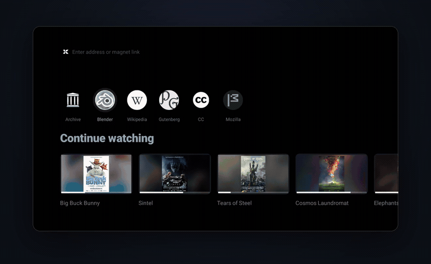
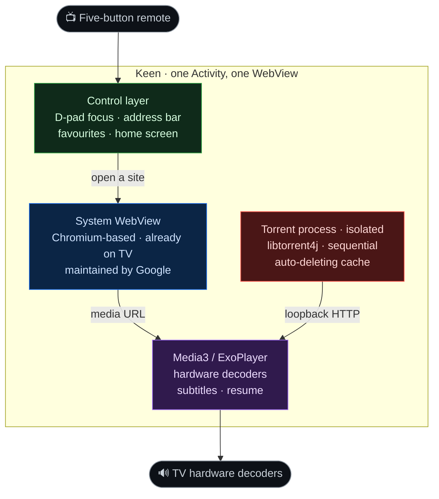

<p align="center">
  <picture>
    <source media="(prefers-color-scheme: dark)" srcset="assets/logo-dark.svg">
    
  </picture>
</p>

<p align="center">
  
</p>

<p align="center">
  <strong>Your Android TV already has a browser engine.<br>Keen just makes it <em>yours</em>.</strong>
</p>

<p align="center">
  <a href="https://github.com/SirPrizeNZ/keen/releases/download/v0.1.94/keen-0.1.94-32bit-armeabi-v7a.apk"></a>
  &nbsp;
  <a href="https://github.com/SirPrizeNZ/keen/releases/latest"></a>
  &nbsp;
  <a href="LICENSE"></a>
</p>

<p align="center">
  
  
  
  
</p>

<p align="center">
  
</p>

<p align="center">
  <sub><em>Real footage, end to end: navigate the remote-first home, open a title, and the torrent loader connects to peers, buffers, and streams straight into the hardware player. Demo title <a href="https://peach.blender.org/">Big&nbsp;Buck&nbsp;Bunny</a> © Blender Foundation, <a href="https://creativecommons.org/licenses/by/3.0/">CC&nbsp;BY&nbsp;3.0</a>.</em></sub>
</p>

---

**Keen is a free, open-source Android TV browser built on a simple idea: reuse the browser engine your device already has**, instead of shipping yet another 100+ MiB copy of Chromium. On top of the system WebView it layers a remote-first control surface, layered ad- and tracker-blocking, hardware-decoded playback, and open-protocol media streaming — an **18.4 MiB** app that makes a cheap, ageing 2 GB TV box genuinely useful again. **No bundled engine. No second browser. No bloat.**

> Open any site on your TV, activate a video or a `magnet:` link, and Keen strips the junk, grabs the stream, and hands it to the hardware decoder — all from a single Activity driven by a five-button remote.

---

## Why it exists

Android TV boxes ship with a perfectly capable browser engine — the **Android System WebView**, a Chromium-based component Google maintains and updates at the OS level. Most "TV browser" apps ignore it and bundle their own 100+ MiB copy of Chromium.

Keen doesn't. It wraps the WebView **already on your device** with three focused layers:

| Layer | What it adds |
|:--|:--|
| **Control** | D-pad focus, pointer fallback, address bar, favourites, a remote-first home screen |
| **Blocking** | Seven-stage ad, popup, redirect and overlay defence |
| **Playback** | Media3 / ExoPlayer with hardware decoders, torrent streaming, subtitle selection, resume |

The result: an **18.4 MiB** signed APK that boots in under a second on a 2 GB box — a capable modern browser on exactly the kind of cheap, low-memory hardware that usually ends up as e-waste, and without the storage, memory and update burden of a second embedded engine. Reusing the platform's own maintained, auto-updated WebView also means Keen inherits Google's security patches instead of shipping a Chromium fork that quietly rots.

---

## What you get

### 🌐 The simplest browser for Android TV
Open any site. Navigate with the D-pad or a pointer. Bookmark favourites to the home screen as tiles. It's a real WebView — every site that works in Chrome on Android works here.

### 🧲 Stream large media over open protocols
Activate a `magnet:` link or a `.torrent` — the open, decentralised way large media is distributed (Creative Commons films like the [Blender open movies](https://studio.blender.org/films/), Linux ISOs, public-domain archives, your own self-hosted library). Keen spins up a **separate BitTorrent process** (`libtorrent4j`), fetches the largest video file **sequentially**, and pipes it over a **loopback-only HTTP bridge** straight into ExoPlayer — so playback starts before the download finishes. Nothing lands in your Downloads folder, and the cache deletes itself when you stop.

### 🔊 Play audio the WebView can't
The WebView's software decoder chokes on E-AC-3, DTS and similar codecs. Keen intercepts the media URL and hands it to **Media3 / ExoPlayer**, which reaches the TV's **hardware decoders** directly. Surround sound just works.

### 💬 Subtitles, automatically
If the stream carries English subtitle tracks, Keen selects them by default. No menu diving.

### ⏯ Resume after anything
A **Continue** card on the home screen remembers your last stream — URL, playback position and torrent download offset. Power cut? Low-memory kill? Reboot? Pick up where you left off.

### 🛡 Seven layers of blocking
Not one filter. Seven:

1. **Network-level** ad & tracker request blocking
2. **Service-worker** request interception
3. **Popup quarantine** — new windows are caught before they render
4. **Hostile-redirect** containment
5. **External-app escape** prevention — no surprise "open in another app" hijacks
6. **Intrusive-overlay** removal
7. **Site-specific** playback & navigation repairs

> [!NOTE]
> Traditional blockers ask *"should this request load?"*
> Keen also asks *"did the user actually choose to go there?"* — legitimate playback and login flows continue, while unwanted popups are destroyed before they ever touch your screen.

### 📺 Built for the remote, not a mouse
- Directional focus reaches off-screen elements and scrolls them into view
- **Long-press OK** toggles between D-pad and pointer mode
- Focus the scrubber and **hold ← / →** to walk playback **one minute at a time**
- Clean fullscreen, clean return, no orphaned UI

### 🪶 Tuned for cheap hardware
- Torrent engine runs in a **separate process** — a crash never takes the browser down
- A **foreground service** keeps Android's app freezer from killing a long stream
- **Memory-pressure cleanup** and continuity checkpoints designed for **2 GB RAM** boxes
- Loopback-only HTTP bridge — nothing is exposed to the network

---

## Download

| | |
|:--|:--|
| **Version** | v0.1.94 (`versionCode` 114) |
| **Platform** | Android TV / Google TV · Android 10+ (API 29+) |
| **ABI** | **32-bit ARM (`armeabi-v7a`)** |
| **Size** | 18.2 MiB (signed) |
| **APK** | **[keen-0.1.94-32bit-armeabi-v7a.apk](https://github.com/SirPrizeNZ/keen/releases/download/v0.1.94/keen-0.1.94-32bit-armeabi-v7a.apk)** |
| **Checksum** | [`SHA256SUMS`](https://github.com/SirPrizeNZ/keen/releases/download/v0.1.94/SHA256SUMS) |
| **Release notes** | [Keen v0.1.94](https://github.com/SirPrizeNZ/keen/releases/tag/v0.1.94) |

The published build is the 32-bit ARMv7 APK for classic Android TV hardware. There is no dedicated arm64 package yet.

### Install over Wi-Fi

1. On the TV, enable **USB debugging** and **Wireless debugging** in Developer options.
2. Note the IP address and port the TV displays.
3. From a computer with Android platform tools:

```bash
adb connect <tv-ip>:<port>
adb install -r keen-0.1.94-32bit-armeabi-v7a.apk
```

4. Accept the debugging prompt on the TV if it appears.

> [!TIP]
> Wireless debugging often shows a port other than `5555` — use the exact one the TV displays.

---

## New in v0.1.94

- 🏠 **K logo returns home** — the mark to the left of the address bar jumps straight back to the home surface from any page (it was opening the keyboard)
- ⏩ **Smoother hold-seek** — holding left/right scrubs slowly at first, then accelerates, and the seek-time readout clears the moment you land
- 📶 **Honest buffering %** — the number only ever climbs and no longer parks at 99% waiting on a de-prioritised tail piece
- ✨ **Lighter Continue-watching heading** and a re-centred app logo in the Android TV **Your apps** banner
- 📡 **Offline vs. site-stall detection** on the "page didn't load" screen

Earlier highlights (v0.1.92): remote-first home with favourites + a Continue card, auto English subtitles, minute-by-minute scrubbing, torrent resume.

---

## Roadmap

- **64-bit (`arm64-v8a`) builds** alongside the 32-bit package for newer boxes
- **Wider site compatibility** — a growing set of per-site playback & navigation repairs
- **More subtitle languages** beyond the current English auto-selection
- **Accessibility** — TalkBack and large-text passes for the remote-first UI
- **Richer favourites** — HTML `<link rel>` favicon resolution and reorderable tiles

Contributions toward any of these are especially welcome — see [Contributing](#contributing).

---

## Architecture at a glance



The loading screen reports live **peers, seeds and speed** with a byte-accurate, smoothly animated progress readout — so you always know what the stream is doing before the first frame.

---

## Responsible use

Keen is a general-purpose browser and an open-protocol media client — the same technology behind Creative Commons film distribution, Linux ISO delivery and public-domain archives.

> [!IMPORTANT]
> Only access content you are legally entitled to. Keen bypasses no DRM and defeats no access controls — it opens the web and open protocols; what you do with them is your responsibility.

---

## Contributing

Contributions are welcome — bug reports, site-compatibility fixes, testing on real TV hardware, and code. Open an [issue](https://github.com/SirPrizeNZ/keen/issues) or a pull request. The project is a single, heavily-commented Android module (Kotlin), so it stays approachable; the [architecture diagram](#architecture-at-a-glance) maps the whole thing end to end.

## License

Keen is **free and open source** under the [GNU Affero General Public License v3.0](LICENSE). You're free to use, study, modify and share it; any modified version you distribute — or run as a network service — must also be offered under the AGPL, so the project stays open for everyone.

Because the project owns its copyright, **commercial licensing is available separately** for anyone who needs terms other than the AGPL — [get in touch](https://github.com/SirPrizeNZ/keen).

© 2026 SirPrizeNZ.
