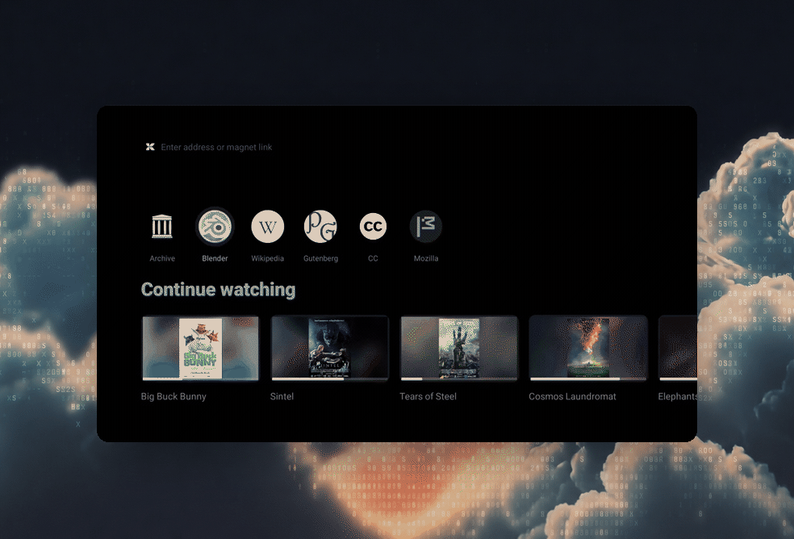

<div align="center">

<br>
<br>

<picture>
  <source media="(prefers-color-scheme: dark)" srcset="assets/logo-dark.svg">
  
</picture>

<br>
<br>
<br>


<br>

**The premium, distraction-free browser and media player built for Android TV.**

<br>

### [Download Keen v0.2.22](https://github.com/SirPrizeNZ/keen/releases/download/v0.2.22/keen-0.2.22-32bit-armeabi-v7a.apk)

18.6 MiB · Android TV 10+ · 32-bit ARM (`armeabi-v7a`)

[64-bit build](https://github.com/SirPrizeNZ/keen/releases/download/v0.2.22/keen-0.2.22-64bit-arm64-v8a.apk) ·
[Release notes](https://github.com/SirPrizeNZ/keen/releases/tag/v0.2.22) ·
[SHA256SUMS](https://github.com/SirPrizeNZ/keen/releases/download/v0.2.22/SHA256SUMS) ·
[Installation](#installation)

<br>



</div>

---

You have invested in a stunning display. You have calibrated the audio. Yet, when you open a standard web browser on your television, the magic evaporates. The interface stutters, intrusive overlays obscure the screen, and simply navigating a menu feels like a chore.

Your living room deserves better than a clunky afterthought.

## Meet Keen

Keen is not merely a ported desktop browser; it is a precision instrument engineered exclusively for the big screen. We have rebuilt the web experience from the ground up to honor the hardware it runs on, transforming your television into a seamless, cinematic portal to the open web.

## Navigation that feels like second nature

We didn't just adapt a cursor for a remote control; we reimagined spatial navigation. Every pixel of Keen is optimized for the D-pad. Focus states are crisp, transitions are fluid, and menu traversal is instantaneous. For the rare, complex sites that demand it, our native pointer layer glides across the screen with zero latency. Browsing finally feels as natural on your couch as it does at your desk.

## Cinematic playback, uncompromised

Standard TV browsers choke on high-bitrate video and modern web codecs. Keen intercepts media streams and hands them directly to your television's native hardware decoders via Media3. The result? Buttery-smooth playback, support for premium audio formats like E-AC-3 and DTS, and flawless full-screen immersion. When the video starts, the browser disappears.

Films that carry more than one audio track let you choose between them from the player controls, so a dual-audio release plays in the language you want.

## A digital sanctuary

The modern web is noisy. Aggressive auto-play ads, deceptive redirects, and malicious overlays shatter the viewing experience. Keen employs a multi-layered, intelligent defense system that neutralizes these distractions before they ever reach your screen. It is smart enough to distinguish between a necessary login prompt and a deceptive popup, ensuring your attention remains exactly where you want it.

## Radically lightweight, unapologetically open

In an era of bloated applications, Keen is an exercise in restraint. By leveraging the native Android System WebView, we deliver a powerhouse experience in a package smaller than 20MB. There is no hidden telemetry, no bundled bloatware, and no walled garden. Keen is proudly open-source, built by enthusiasts, for enthusiasts.

## Designed for the couch

- **Continue Watching:** Pick up exactly where you left off with elegant home-screen cards.
- **Smart History:** Address completion driven by your actual browsing habits.
- **One Live View:** A single, optimized WebView environment. No messy stacks of forgotten tabs.

## Our commitment to the open web

Keen is a general-purpose web browser and media player designed to celebrate the open internet. We strictly respect intellectual property rights, bypass no DRM, and host no media. We simply provide the most beautiful, efficient window to the web ever built for a television. What you choose to view through that window is entirely up to you.

> [!IMPORTANT]
> Only access content you are legally entitled to. Keen bypasses no DRM and defeats no access controls. It opens the web and open protocols; what you do with them is your responsibility.

Experience the web the way it was meant to be seen.

## Installation

Keen is not currently distributed through the Google Play Store. Download the APK above and sideload it onto your Android TV or Google TV device.

### Which build to install

Install the 32-bit build unless you are certain your device runs a 64-bit Android system. It is the right one for virtually every television and streaming box, and it updates an existing install in place, keeping favourites, history, watch positions and saved downloads.

The 64-bit build is only for devices running a 64-bit Android system, in practice the Nvidia Shield TV and the 2nd-generation Fire TV Cube. Nearly all TV hardware runs a 32-bit system on 64-bit silicon, including the Google TV Streamer and the onn 4K Pro. If you are unsure, install the 32-bit one; the 64-bit APK simply refuses to install (`INSTALL_FAILED_NO_MATCHING_ABIS`) on a device that cannot run it. Check with:

```bash
adb shell getprop ro.product.cpu.abilist
```

The 64-bit build installs alongside the 32-bit one rather than upgrading it, so the two do not share favourites or watch positions.

### Install over Wi-Fi with ADB

1. Open Developer options on the television.
2. Enable Wireless debugging or USB debugging.
3. Note the IP address and port displayed by the television.
4. Connect from a computer with Android platform tools installed.
5. Install the downloaded APK.

```bash
adb connect <tv-ip>:<port>
adb install -r <keen-apk-filename>
```

For example:

```bash
adb install -r keen-0.2.22-32bit-armeabi-v7a.apk
```

Use the exact IP address and port displayed by the television. Wireless debugging may use a port other than `5555`.

The `-r` flag updates an existing installation while preserving its local data.

### Tested hardware

Keen is developed and tested on a Xiaomi MiTV-AFMU0 (twilight) running Android TV 14, which
is a 32-bit (`armeabi-v7a`) system.

The 64-bit build has not yet been run on 64-bit hardware. It is verified only as far as
packaging. Reports from Shield TV and Fire TV Cube owners are particularly welcome, as is
testing on any other Android TV or Google TV device.

## Roadmap

- Confirmation of the 64-bit build on real 64-bit hardware
- Wider site compatibility, driven by whatever breaks on real televisions

## Contributing

Contributions are welcome, including bug reports, site-compatibility fixes, testing on real Android TV hardware, ad-blocking improvements, playback fixes, documentation and Kotlin code.

Open an issue or submit a pull request.

Keen is a single, heavily commented Android module written in Kotlin. The project is intended to remain understandable and approachable rather than becoming another oversized browser codebase.

See [CONTRIBUTING.md](CONTRIBUTING.md) to get started.

## Licence

Keen is free and open source under the [GNU Affero General Public License v3.0](LICENSE).

You are free to use, study, modify and share it. Any modified version you distribute, or run as a network service, must also make its corresponding source code available under the AGPL.
